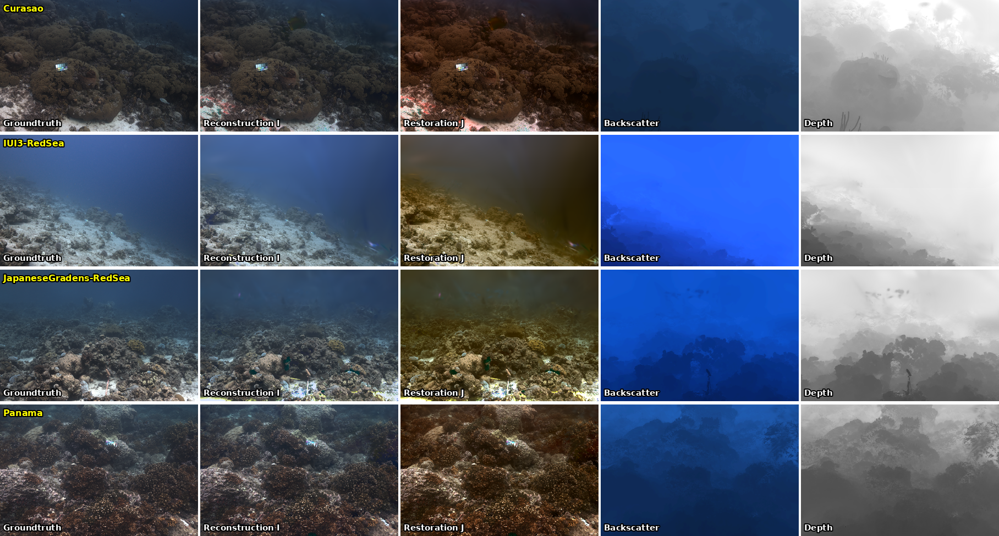
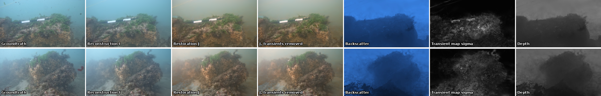
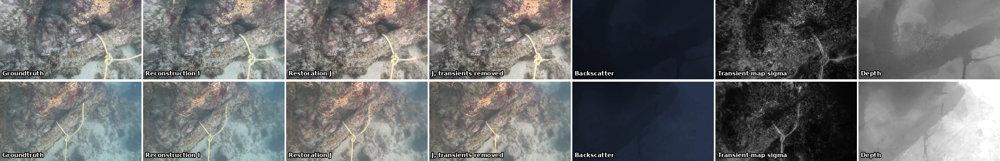
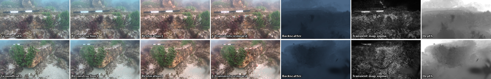
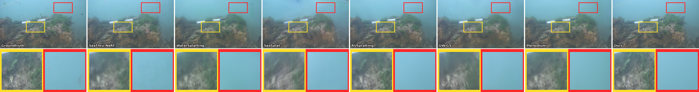
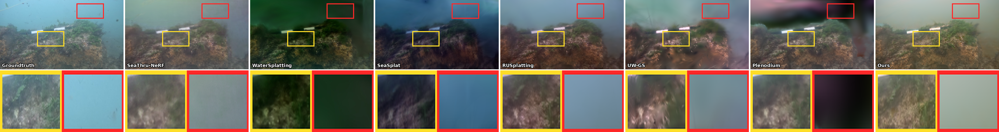
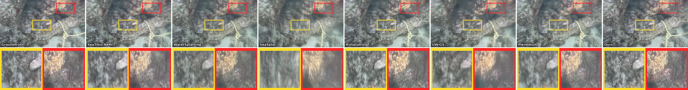
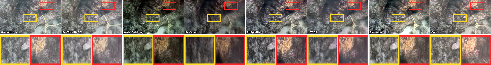
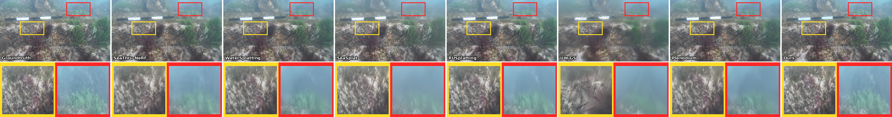
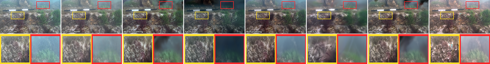

# PhysDecouple-4DGS: Dynamic Underwater Scene Restoration and Transient Distractor Removal

This repository contains the official codebase for **PhysDecouple-4DGS**, a framework designed for high-fidelity 4D underwater scene reconstruction, physical medium decoupling, and transient distractor removal (e.g., dynamic fish, bubbles, and floating debris) built upon 4D Gaussian Splatting (4DGS).

---

## 🌟 Key Features

- **Physical Decoupling of Light Transport**: Decouples scene radiance, medium transmission, and backscatter under complex underwater optical paths using a 19-parameter physical medium model.
- **Transient Distractor Removal**: Integrates a dynamic transient map ($\sigma$) optimization scheme that isolates and filters out transient distractors (such as fish or bubbles) to reconstruct a clean, static background.
- **Hard Spectral Orderings & Range Stop-Gradients**: Prevents parameter degeneracy and ensures robust optimization across diverse underwater light spectra.
- **High-Quality Real-Time Rendering**: Restores high-fidelity, color-accurate, and backscatter-free dynamic underwater scenes with fast inference speeds.

---

## 🛠️ Environmental Setups

Please follow these steps to install the environment and the required submodules:

```bash
# Clone the repository and initialize submodules
git clone https://github.com/saiteja-ms/PhysDecouple-4DGS-Dynamic-Underwater-Scene-Restoration-and-Transient-Distractor-Removal..git
cd PhysDecouple-4DGS-Dynamic-Underwater-Scene-Restoration-and-Transient-Distractor-Removal.

# Set up conda environment
conda create -n physdecouple python=3.10
conda activate physdecouple

# Install dependencies
pip install -r requirements.txt
pip install -e submodules/depth-diff-gaussian-rasterization
pip install -e submodules/simple-knn
```

---

## 📂 Dataset Preparation

Organize your raw datasets (e.g., NUSR, SeaThru-NeRF, or custom datasets) under a `Data/` directory:

```
├── Data
│   ├── seathrunerf
│   │   └── SeathruNeRF_dataset
│   │       ├── Curasao
│   │       ├── IUI3-RedSea
│   │       ├── JapaneseGradens-RedSea
│   │       └── Panama
│   ├── set4
│   ├── set5
│   ├── set8
│   ├── set9
│   ├── set12
│   ├── set13
│   └── synthetic_blender
```

---

## 🚀 Training and Rendering Commands

Below are the exact commands used to run training and rendering on this codebase.

### 1. Training Commands
We train using `train.py` with custom configurations specified under `arguments/`.

* **To train on SeaThru-NeRF scenes (e.g., Panama)**:
  ```bash
  python train.py \
    -s Data/seathrunerf/SeathruNeRF_dataset/Panama \
    --port 6009 \
    --configs arguments/hypernerf/physdecouple_uw.py \
    --model_path output/seathrunerf/Panama \
    --expname seathrunerf_panama
  ```

* **To train on other dynamic underwater scenes (e.g., set4)**:
  ```bash
  python train.py \
    -s Data/set4 \
    --port 6013 \
    --configs arguments/hypernerf/physdecouple_uw.py \
    --model_path output/set4_physdecouple_v14 \
    --expname set4_physdecouple
  ```

### 2. Rendering Commands
To render train/test/video frames and generate decoupled components, we use the `scratch_render.py` script which loads checkpoint arguments and configurations correctly:

```bash
# Render all splits (train, test, and video mp4) for a trained model checkpoint
python scratch_render.py -m output/seathrunerf/Panama --iteration 25000

# To render only test splits (skipping train and video)
python scratch_render.py -m output/seathrunerf/Panama --iteration 25000 --skip_train --skip_video
```

The rendered outputs are saved under the model's directory in subfolders containing:
- `renders/`: Raw underwater reconstruction
- `renders_transient_removed/`: Restored background frames (transient removed)
- `depth_norm/`: Normalized depth maps
- `backscatter/`: Estimated backscatter maps
- `video_rgb.mp4`: Combined rendering sequence

### 3. Zipping Output Results
To package all the generated rendered frames and videos for quick downloading:
```bash
python scratch/zip_results.py
```
This generates `rendered_results.zip` in the project root containing only the rendered output directories.

---

## 📊 Qualitative Factorization Results

Below are the key results showing physical medium decomposition, novel view synthesis (NVS), and underwater image restoration (UIR) on the datasets.

### 1. SeaThru-NeRF Decoupling & Restoration
Physical medium decomposition showing raw inputs, reconstructed views, backscatter separation, and clean restorations across SeaThru-NeRF scenes:


### 2. Physical Medium Factorization (Set 4, 5, & 8)
- **Set 4 Decomposition**:  
  
- **Set 5 Decomposition**:  
  
- **Set 8 Decomposition**:  
  

### 3. Novel View Synthesis (NVS) & Underwater Image Restoration (UIR)
- **Set 4 NVS**:  
  
- **Set 4 UIR**:  
  
- **Set 5 NVS**:  
  
- **Set 5 UIR**:  
  
- **Set 8 NVS**:  
  
- **Set 8 UIR**:  
  

---

## 📄 Contributions & Acknowledgements

This work builds upon the foundations of [4D Gaussian Splatting (4DGS)](https://github.com/hustvl/4DGaussians), [3DGS](https://github.com/graphdeco-inria/gaussian-splatting), [K-planes](https://github.com/Giodiro/kplanes_nerfstudio), and [HexPlane](https://github.com/Caoang327/HexPlane). We sincerely thank the authors of these excellent codebases.
